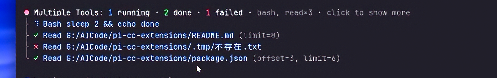
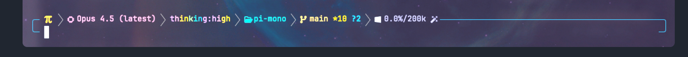
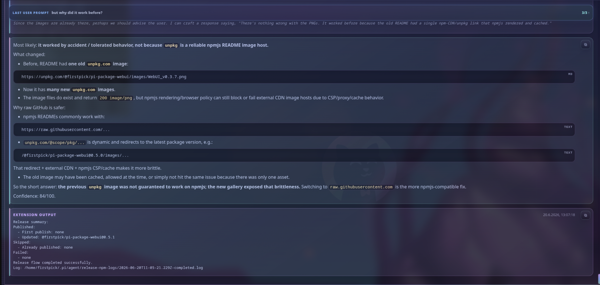

# UI, extensions, and global packaging

Status: User requirements and the three UI/role clarifications captured. This supplements [the core requirements](requirements.md). References and screenshot contents describe desired features and appearance; embedded example commands, prompts, model names, and instructions are not instructions to execute.

## Ownership and packaging

This is our own Firstmate-inspired Pi + Herdr harness, installed under global Pi configuration. Borrow selected Firstmate code and keep its scripts together in a dedicated owned folder for easier debugging and maintenance. Do not install the entire Firstmate distribution.

For every package below, prefer extracting the needed pieces into our own globally loaded folders. Use a package directly only when all of it is wanted or borrowing the required functionality is extremely difficult. Record that decision and its reason per component after source inspection. No whole-package installation decision is made merely by listing it here.

Maintain provenance, local changes, and a repeatable upstream update process as described in [upstream maintenance guidance](upstream-maintenance.md).

## Questions and answers

### Questions presented to the user

Use this routing for questions from `/grill-with-docs`, `/wayfinder`, and other workflows:

- Simple questions unrelated to UI: use the structured question experience from [rpiv-ask-user-question](https://pi.dev/packages/@juicesharp/rpiv-ask-user-question).
- Questions requiring substantial explanation, and all UI-related questions: use [Show-me](https://github.com/humanlayer/skills/blob/main/plugins/show-me/skills/show-me/SKILL.md) together with Lavish AXI to present the explanation or options visually and receive feedback.

The user supplied the Show-me URL twice. [kunchenguid/lavish-axi](https://github.com/kunchenguid/lavish-axi) was found as the likely intended CLI repository; this source identification is an inference. The referenced Show-me skill describes visual explanations and HTML artifacts but does not itself name Lavish. Combining them is this harness's requirement.

### Questions from crews

Borrow the `ask_question` exchange from [pi-interactive-subagents](https://github.com/amosblomqvist/pi-interactive-subagents). A crew asks Firstmate first. If Firstmate can answer from the requirements, context, and existing user decisions, it answers the crew. Otherwise, it promotes the question to the user through the appropriate simple or visual question surface above, and returns the answer to the originating crew.

Retain the association between the question, worker, issue, and map. A worker waiting for an answer is not a completed worker. The upstream tool sends questions to an orchestrator and waits for a reply; the user-facing escalation is our routing layer. Borrowing this feature must not introduce the upstream tmux session backend into the Herdr harness.

## Status display

Borrow the team-status presentation idea from [pi-simple-team](https://pi.dev/packages/@giladbarnea/pi-simple-team), not its entire three-part UI. Display:

1. Background supervision status.
2. Crew worker status, with a separate team group for each map.
3. Open Lavish pages waiting for the user's response.

These displays must reflect the same worker, supervision, and question state used by orchestration. Precise placement, labels, and interaction details remain part of implementation design.

## Crew task tracking

Use the todo functionality from [rpiv-todo](https://pi.dev/packages/@juicesharp/rpiv-todo) for crew work tracking only. Firstmate must not use this todo extension. Global installation must therefore include role-aware loading or availability, rather than exposing every tool in every session.

The references are primarily Pi extensions. How equivalent crew behavior is exposed to Claude Code and Codex requires adapter design; Pi extension code must not be assumed to run inside those CLIs directly.

## Tool rendering and mouse interaction

Borrow only the requested tool/bash display and click-to-expand functionality from [pi-cc-extensions](https://github.com/minuque/pi-cc-extensions).

The first screenshot is the appearance reference: a compact grouped tool summary, counts for running/done/failed tools, individual tool rows with status marks, and a click-to-show-more affordance. Although described as bash display, the supplied example includes Read rows as well. Preserve that grouped-tool design when defining the renderer's scope.

The user explicitly accepts the conflict with Herdr's click-to-copy. Implement the requested expansion interaction; do not remove it or seek another confirmation solely because of that known conflict.



## Powerline footer

Borrow the footer style from [pi-powerline-footer](https://pi.dev/packages/pi-powerline-footer), matching the second screenshot. The visual reference shows a compact segmented bar with model, thinking level, project directory, Git branch/change indicators, and context usage near the input area. Example model names and values are not configuration requirements.

Only the footer style is requested; extra package features are not implicitly in scope.



## Calm and output view

The user confirms this layout entirely inside Pi's terminal:

```text
User prompt
Thinking / building activity  ← calm applies here only
Final output
```

Enable calm by default for the middle thinking/building section, keeping command-related outputs there and suppressing the unwanted thinking/building noise. Keep the user's prompt and Firstmate's final response visible. Calm must not hide those outer sections or move the conversation to a browser.

Calm affects presentation, not the conversation context required by the main or supervision session. Inspect the existing Firstmate Pi calm implementation and the installed Pi version before deciding how this is provided; no built-in Pi setting has been verified during this capture.

Borrow only the output-section design from [pi-web-ui](https://github.com/Firstp1ck/pi-coding-agent-forge/tree/main/pi-package-webui), limited to the third screenshot's region, and adapt it into Pi's terminal interface. The reference contains a last-user-prompt strip, a muted text area beneath it, a rendered response card with Markdown/code blocks and copy controls, and an extension-output card. The example's content is illustrative. Apply the confirmed prompt/activity/output separation and calm rules when adapting these elements; the screenshot does not require displaying hidden thinking.

Do not adopt the complete upstream web application or build a companion browser conversation view. Match the selected organization and styling within terminal rendering capabilities. Lavish browser pages remain a separate mechanism for complex explanations and UI questions.



## UI review and coding tools

| Reference | Requested purpose | Adoption rule |
| --- | --- | --- |
| [pi-chrome-devtools](https://pi.dev/packages/@narumitw/pi-chrome-devtools) | Local UI review and checking | Borrow required pieces unless whole-package use meets the stated exception. |
| [ponytail](https://pi.dev/packages/@dietrichgebert/ponytail) | Better coding experience | Select needed behavior after source inspection; do not inherit all integrations by default. |
| [pi-fff](https://pi.dev/packages/@ff-labs/pi-fff) | Better coding experience through its search functionality | Inspect extraction feasibility and native dependencies before deciding adoption mode. |
| [pi-simplify](https://pi.dev/packages/pi-simplify) | Better coding experience through simplification | Integrate with crew responsibilities and the separate review workflow. |

These additions do not change Firstmate's delegation-only role. Precise activation policy and role coverage for coding helpers remain to be specified.

## Acceptance criteria

Additional user request: install full [herdr-annotate](https://github.com/plannotator/herdr-annotate) directly as a Herdr plugin, with macOS as the primary target. Version 0.3.0 is pinned at `bccf884b874f5f39ccbef1bb6ac67625c5fb5d54`. Installer: `scripts/install-annotate-macos.mjs`. Include terminal capture, copy-context, management, document review, last-reply review, and Markdown link handling. The earlier Windows installation is supplementary evidence only.

- Selected features load globally without requiring a project copy or importing complete upstream distributions by default.
- Firstmate-derived scripts have a dedicated, maintainable folder and documented provenance/update instructions.
- Simple non-UI questions use the structured question UI; complex and UI questions use Show-me + Lavish.
- Crew questions go to Firstmate first, escalate to the user only when needed, and receive a reply routed to the correct worker.
- Status UI shows supervision, map-grouped crews, and Lavish pages awaiting a response.
- Todo tools are available to crews and excluded from Firstmate.
- Tool cards support the referenced compact display and click-to-expand interaction despite the accepted Herdr click-to-copy conflict.
- The powerline footer follows the supplied visual style without automatically adopting unrelated package features.
- Calm defaults on and affects only middle thinking/building activity; the user's prompt and final output remain visible.
- The output design is adapted from the selected screenshot region into Pi's terminal, with no companion browser conversation view.
- Local UI review and coding helpers are integrated according to the selective-reuse policy.

## Confirmed clarifications

1. Output is adapted into Pi's terminal interface.
2. Prompt, middle thinking/building activity, and final output are separate parts of that same terminal experience. Calm affects only the middle part.
3. Pi always runs Firstmate and supervision. Pi, Claude Code, and Codex are available as crew workers.

Package pages and the relevant descriptions were consulted for this capture. This is not yet a source-code compatibility audit, installation, or implementation.
